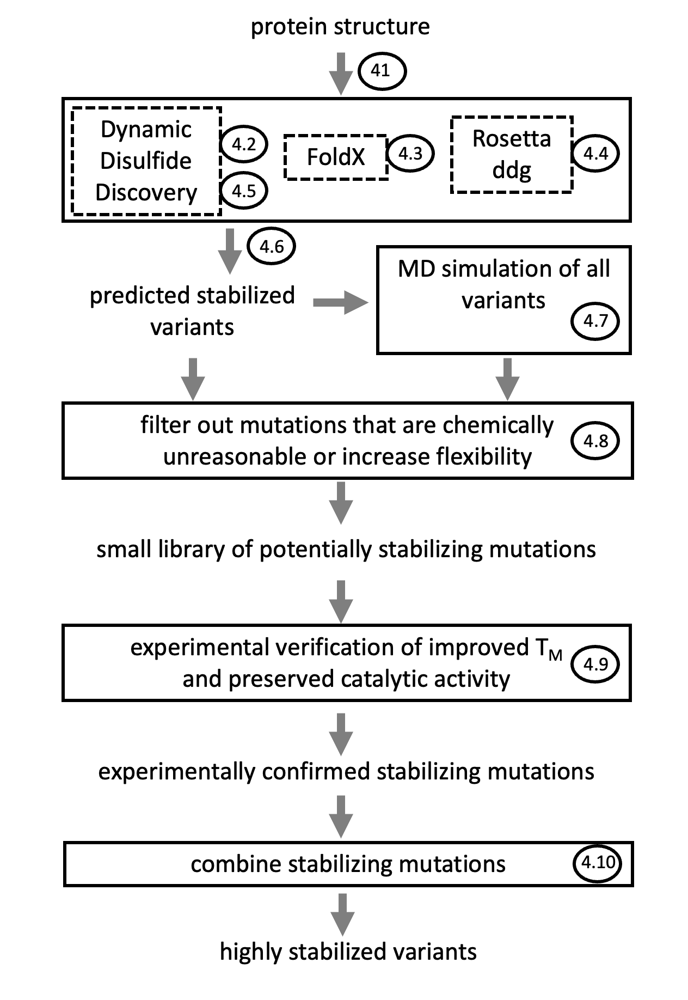
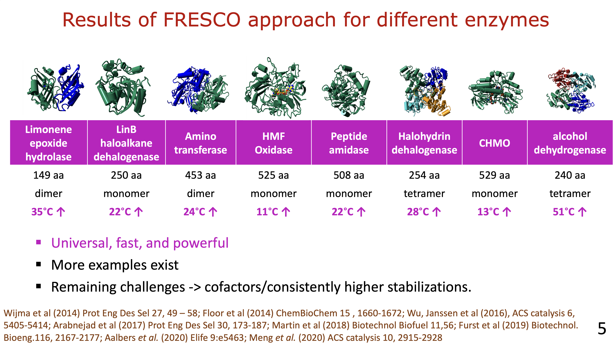
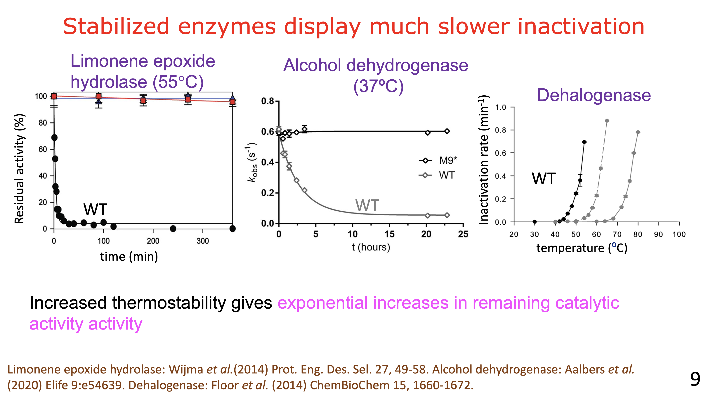
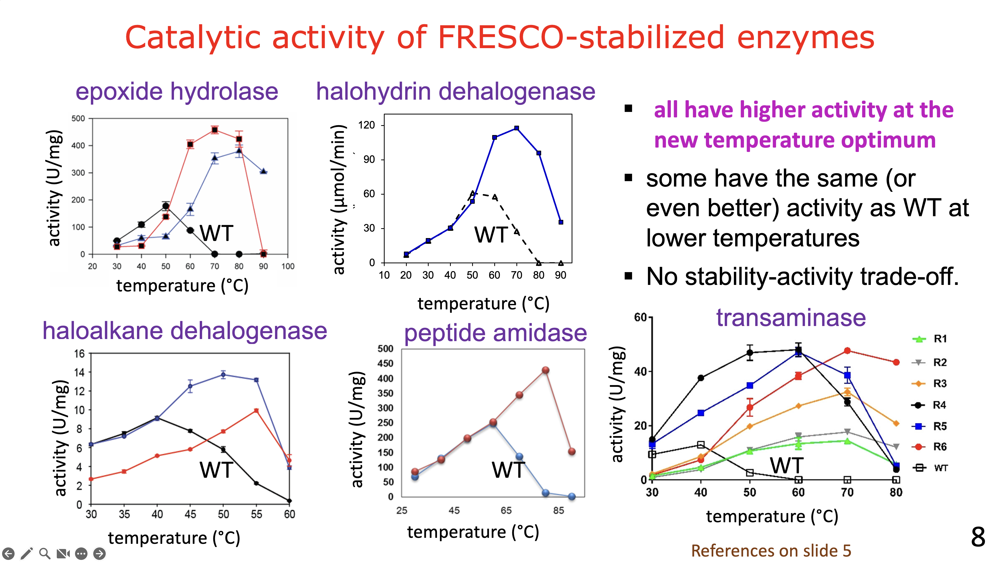

# fresco
A proven and powerful methods to stabilize proteins.

**The main characteristics of FRESCO are (see figures below)**
- aims to include as many stabilizing mutations as possible in the final variants (Scheme 1)
- proven to work on > 8 proteins (Fig. 1)
- high improvements in apparent melting temperature (Fig. 1) and much higher operational stability (Fig. 2)
- no signs of an activity-stability trade-off (Fig. 3)
- experimentally, it requires screening one or a few 96-well plates

**practical information**
- a detailed 31 page manual (named protocolFRESCO_versionInformation.pdf) is available, written for those not experienced with computational work with the command line
- the manual includes a working example to follow
- the manual was written for the Mac command line but can easily be adapted for a Linux command line, for which hints are provided. 
- the workflow requires external software that needs to be obtained via licenses. Specifically this version of FRESCO was tested with the latest versions of FoldX (2026, from https://foldxsuite.crg.eu/), the latest version of Yasara-Dynamics (25.12.2 via https://www.yasara.org/), and with an archive version of Rosetta (2015.25.20.57927, still available for download via https://rosettacommons.org/). The manual includes a description of how to install these external software.
- it is a good idea to test in advance if the targeted protein can be screened easily for thermostability. In our experience, for some 20% of the proteins give problems with standard medium throughput assays like ThermoFluor, requiring finding alternatives.

**Scheme 1. Workflow diagram of FRESCO.** The numbers refer to sections in the manual. 

**Figure 1. Overview stabilized enzymes.**

**Figure 2. Examples slower inactivation by FRESCO-stabilized enzymes.**

**Figure 3. Examples preserved or even improved catalytic activity by FRESCO-stabilized enzymes.**

 
